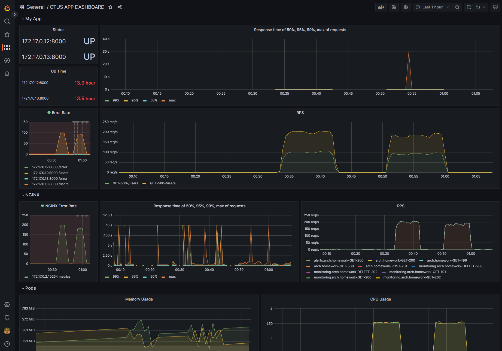
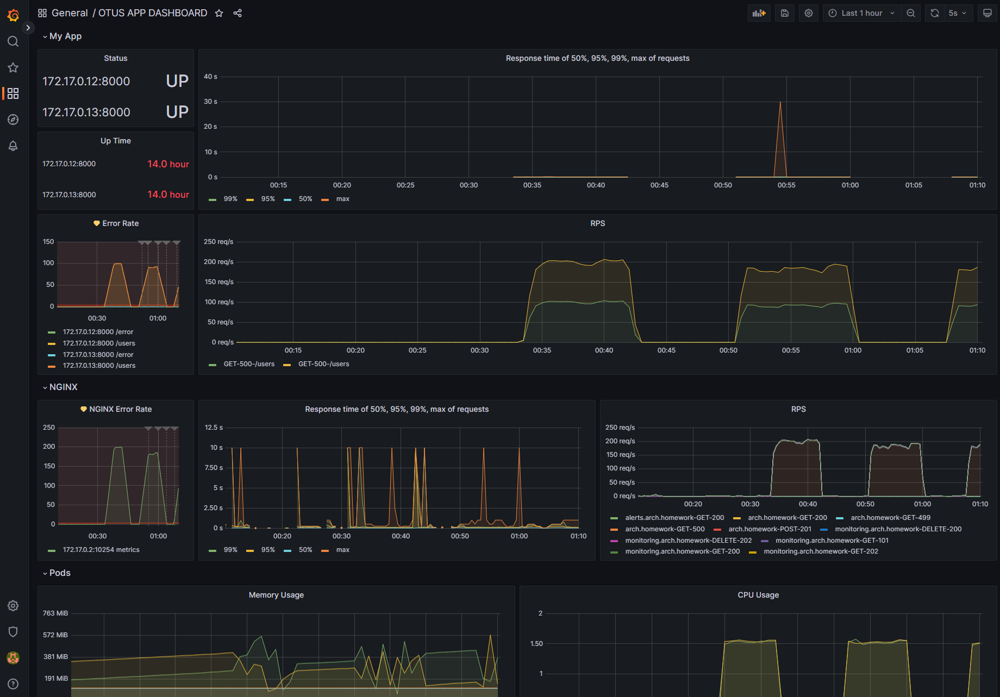
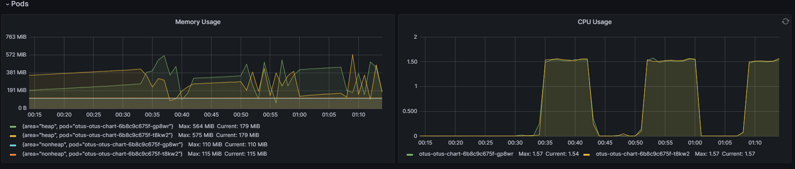

# Getting Started

````
Домашнее задание
Prometheus. Grafana

Цель:
В этом ДЗ вы научитесь инструментировать сервис.

Описание/Пошаговая инструкция выполнения домашнего задания:

Инструментировать сервис из прошлого задания метриками в формате Prometheus с помощью библиотеки для вашего фреймворка и ЯП.
Сделать дашборд в Графане, в котором были бы метрики с разбивкой по API методам:

1. Latency (response time) с квантилями по 0.5, 0.95, 0.99, max
2. RPS
3. Error Rate - количество 500ых ответов
Добавить в дашборд графики с метрикам в целом по сервису, взятые с nginx-ingress-controller:
4. Latency (response time) с квантилями по 0.5, 0.95, 0.99, max
5. RPS
6. Error Rate - количество 500ых ответов
Настроить алертинг в графане на Error Rate и Latency.

На выходе должно быть:
0. скриншоты дашборды с графиками в момент стресс-тестирования сервиса. Например, после 5-10 минут нагрузки.
1. json-дашборды.

Задание со звездочкой (+5 баллов)
1. Используя существующие системные метрики из кубернетеса, добавить на дашборд графики с метриками:
2. Потребление подами приложения памяти
Потребление подами приолжения CPU

Инструментировать базу данных с помощью экспортера для prometheus для этой БД.
Добавить в общий дашборд графики с метриками работы БД.
Альтернативное задание на 1 балл (если не хочется самому ставить prometheus в minikube) - https://www.katacoda.com/schetinnikov/scenarios/prometheus-client
````

## Homework - 4

### Prometheus. Grafana

Создать namespace monitoring

````bash
kubectl create namespace monitoring
````

Добавить репозиторий в helm

````bash
helm repo add prometheus-community https://prometheus-community.github.io/helm-charts
````

Обновить репозиторий

````bash
helm repo update
````

Установить пакет kube-prometheus-stack

````bash
helm install prometheus prometheus-community/kube-prometheus-stack -f prometheus/operator-values.yaml --atomic --namespace=monitoring

````

Проверить что все запустилось

````bash
kubectl --namespace monitoring get pods -l "release=prometheus"
````

Добавить сервис типа NodePort для прямого доступа к Prometheus и Grafana:

```shell script
kubectl apply -f prometheus/monitoring-nodeport.yaml
```

Открыть web-интерфейс Grafana:

```shell script
minikube service -n monitoring prometheus-grafana-nodeport
```

Если все хорошо ответ будет:

````
NAME                                            READY   STATUS    RESTARTS   AGE
prom-operator-8578b868d-n6mt6                   1/1     Running   0          59s
prometheus-kube-state-metrics-75cb965fc-q4dmw   1/1     Running   0          59s
prometheus-prometheus-node-exporter-b9x5m       1/1     Running   0          59s

````

Применить правила Ingress для GUI grafana

````bash
kubectl apply -f ingress.yaml --namespace=monitoring
````

Добавить в файл hosts

````
127.0.0.1 arch.homework monitoring.arch.homework prometheus.arch.homework
````

Открыть в браузере:

````
http://monitoring.arch.homework
````

Выбрать dashboard "OTUS APP DASHBOARD"

### Benchmarks

Load Testing For API With Apache Benchmark

````bash
C:/Apache24/bin/ab -n 100000 -c 100 -H'Host: arch.homework' http://arch.homework/users
````

Для симуляции нагрузки на приложение (метод POST)

````bash
./create-users.sh
````

Для симуляции нагрузки на приложение (метод GET)

````bash
./get-users.sh
````

Для симуляции 500 ответов от приложения

````bash
./error.sh
````

### Скриншоты в момент стресс-тестирования сервиса





[json-дашборд](dashboard2.json)

### Потребление подами памяти и Потребление подами CPU


