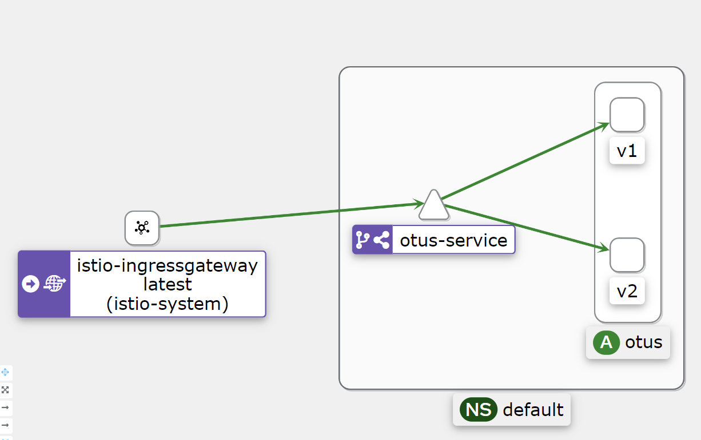

# Getting Started

````
Домашнее задание
Развернуть в кластере две версии приложения и настроить балансировку трафика между ними
````

## Задачи

Задание состоит из этапов

- Развернуть Minikube
- Развернуть Istio c Ingress gateway
- Развернуть две версии приложения с использованием Istio
- Настроить балансировку трафика между версиями приложения на уровне Gateway 50% на 50%
- Сделать снимок экрана с картой сервисов в Kiali с примеров вызова двух версии сервиса


## Выполнение

Создать неймспейсы для операторов:

```shell script
kubectl apply -f namespaces.yaml
```

### Разворачиваем Jaeger

Jaeger - решение трассировки. Компоненты Istio, такие как: sidecar-контейнер, gateway, отправляют данные запросов в
систему. Таким образом получается полная трассировка запроса.

Добавить репозиторий в Helm:

```shell script
helm repo add jaegertracing https://jaegertracing.github.io/helm-charts
helm repo update
```

Установить оператор, разворачивающий Jaeger:

```shell script
helm install --version "2.19.0" -n jaeger-operator -f jaeger/operator-values.yaml jaeger-operator jaegertracing/jaeger-operator
``` 

Развернуть Jaeger:

```shell script
kubectl apply -f jaeger/jaeger.yaml
```

Проверить состояние Jaeger:

```shell script
kubectl get po -n jaeger -l app.kubernetes.io/instance=jaeger
```

Открыть web-интерфейс Jaeger:

```shell script
minikube service -n jaeger jaeger-query-nodeport
```

### Разворачиваем Istio

Istio - Service mesh решение для облачных платформ, использующее Envoy.

````shell script
helm repo add istio https://istio-release.storage.googleapis.com/charts
helm repo update

````

Установить оператор, разворачивающий Istio:

```shell script
istioctl operator init --watchedNamespaces istio-system --operatorNamespace istio-operator
```

Развернуть Istio c помощью оператора:

```shell script
kubectl apply -f istio/istio.yaml
```

```shell script
kubectl delete -f istio/istio.yaml
```

Проверить состояние Istio:

```shell script
kubectl get all -n istio-system -l istio.io/rev=default
```

Установить настройки по-умолчанию:

```shell
kubectl apply -f istio/disable-mtls.yaml
```

### Устанавливаем Kiali

Kiali - доска управления Service mesh

Добавить репозиторий в Helm:

```shell script
helm repo add kiali https://kiali.org/helm-charts
helm repo update
```

Установить Kiali Operator, разворачивающий Kiali

```shell script
helm install --set cr.create=true --set cr.namespace=istio-system --version "1.67.0" -n kiali-operator -f kiali/operator-values.yaml kiali-operator kiali/kiali-operator
```

Развернуть Kiali:

```shell script
kubectl apply -f kiali/kiali.yaml
```

```shell script
kubectl delete -f kiali/kiali.yaml
```

Проверить состояние Kiali:

```shell script
kubectl get po -n kiali -l app.kubernetes.io/name=kiali
```

Открыть web-интерфейс Kiali:

```shell script
minikube service -n kiali kiali-nodeport
```

### Устанавливаем otus-service

otus-service - наш созданный ранее сервис.

Развернуть приложение `otus` в кластере:

```shell script
kubectl apply -f app/otus.yaml
```

Проверить статус otus:

```shell script
kubectl get po -l "app=otus"
```

```shell script
kubectl apply -f manage-traffic/proxy-app-sidecar-enable.yaml
```

## Настраиваем Service Discovery

Применить настройки service-discovery:

```shell script
kubectl apply -f service-discovery/
```

Настроим Ingress Gateway

```shell script
kubectl apply -f http-gateway.yaml
```

Выполнить запрос к сервису `otus-service`:

````bash
curl 'http://arch.homework'
````

В результате исполнения команды видно, что запрос на `otus-service` проходит.



-----------------------------------------------------------------------------------

### Устанавливаем proxy-app

Proxy-app - сервис, умеющий запрашивать другие запросы по query-параметру url.

Развернуть приложение `proxy-app` в кластере:

```shell script
kubectl apply -f app/proxy-app.yaml
```

Проверить статус приложения:

```shell script
kubectl get po -l "app=proxy-app"
```

Выполнить запрос к сервису:

```shell script
curl $(minikube service proxy-app --url)
```

```shell script
minikube service proxy-app
```

Посмотреть логи приложения:

```shell script
kubectl logs -l app=proxy-app -c proxy-app
```

### Нагружаем приложения

Собрать нагрузочный образ:

```shell script
docker build -t snaiperlfc/load-otus-demo:latest -f app/load/Dockerfile app/load
```

```shell script
docker push snaiperlfc/load-otus-demo:latest
```

Запустить нагрузочный образ:

```shell script
kubectl apply -f app/load.yaml
```

Посмотреть логи нагрузки:

```shell script
kubectl logs -l app=load
```

## Настраиваем взаимодействие между сервисами

Сервис `proxy-app` позволяет запросить другие сервисы с помощью параметра url, сделаем это.

Выполнить запрос к сервису `otus-service`:

```shell script
curl "$(minikube service proxy-app --url)?url=http://otus-service"
```

В результате исполнения команды видно, что запрос на `otus-service` проходит.

Ограничим доступ `proxy-app` ко всем сервисам:

```shell script
kubectl apply -f manage-traffic/proxy-app-sidecar-disable.yaml
```

Выполнить запрос к сервису `otus-service`:

```shell script
curl "$(minikube service proxy-app --url)?url=http://otus-service"
```

В результате исполнения команды получается ошибка, так как правила для исходящего трафика `proxy-app` настроены таким
образом,
что ему запрещены любые исходящие сетевые соединения.

Применим настройки, в которых сказано, что `proxy-app` может осуществлять запросы к `otus-service`:

```shell script
kubectl apply -f manage-traffic/proxy-app-sidecar-enable.yaml
```

## Others

## Настраиваем безопасности

В качестве примера настройки безопасности будем использовать настройку межсервисной аутентификации.

Включить аутентификацию для `echoserver`:

```shell script
kubectl apply -f auth/echoserver-auth.yaml
```

Выполнить запрос к сервису `echoserver`:

```shell script
curl "$(minikube service proxy-app --url)?url=http://echoserver"
```

Выполнить запрос к сервису с указанием токена:

```shell script
curl -H "X-AUTH-TOKEN: token" "$(minikube service proxy-app --url)?url=http://echoserver"
```

Добавить автоматическую подстановку токена при вызове сервиса `echoserver`:

```shell script
kubectl apply -f auth/proxy-app-auth.yaml
```

Выполнить запрос к сервису `echoserver` без указания токена:

```shell script
curl "$(minikube service proxy-app --url)?url=http://echoserver"
```

## Настраиваем отказоустойчивость

Рассмотрим настройку отказоустойчивости для метода `http://echoserver/error?times=3`. При его вызове
последовательно возвращается 500 ошибка в количестве, указанном в параметре `times`. В этом случае
метод вернёт ошибку 3 раза, а на 4 вернет код 200.

```shell script
curl "$(minikube service proxy-app --url)?url=http://echoserver/error?times=3"
```

Применим правило, которое позволяет автоматически делать повтор запроса при возникновении ошибок с кодом 500
или ошибок соединения.

Применить политику повторов:

```shell script
kubectl apply -f retries/echoserver-retries.yaml
```

Выполнить запрос:

```shell script
curl "$(minikube service proxy-app --url)?url=http://echoserver/error?times=3"
```

## Настраиваем Service Discovery

Применить настройки service-discovery:

```shell script
kubectl apply -f service-discovery/
```

## Получить настройки iptables

```shell
docker inspect <app-container> --format '{{ .State.Pid }}'
nsenter -t <pid> -n iptables -t nat -S
```

